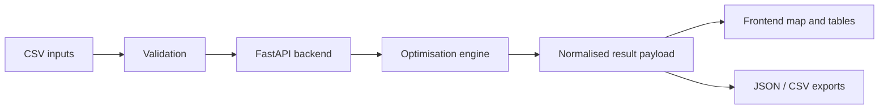
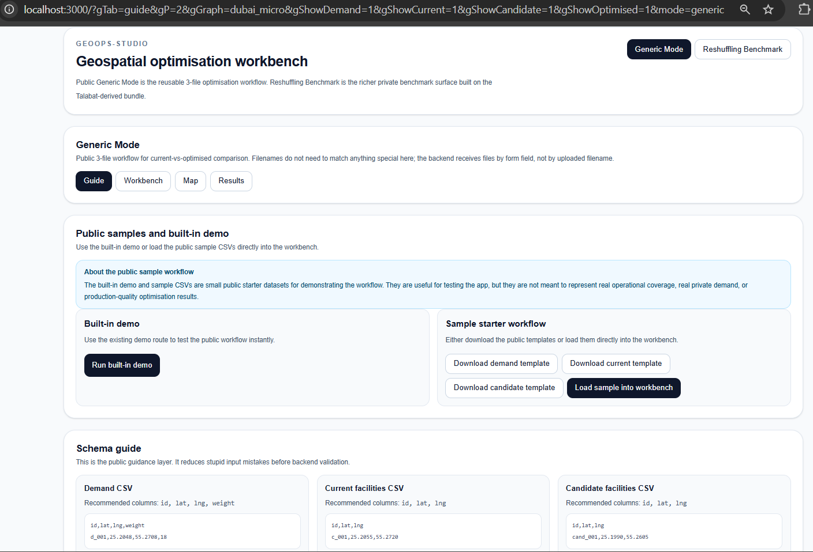
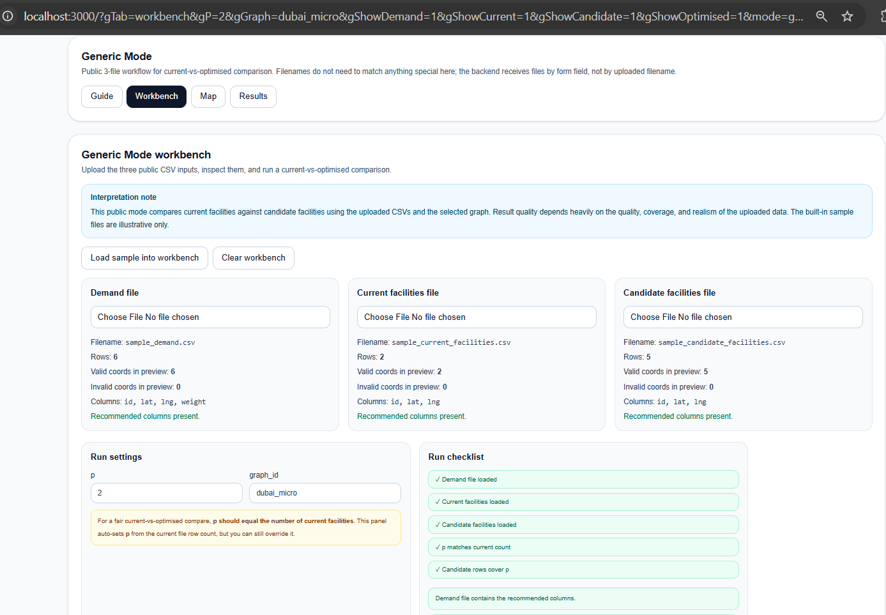
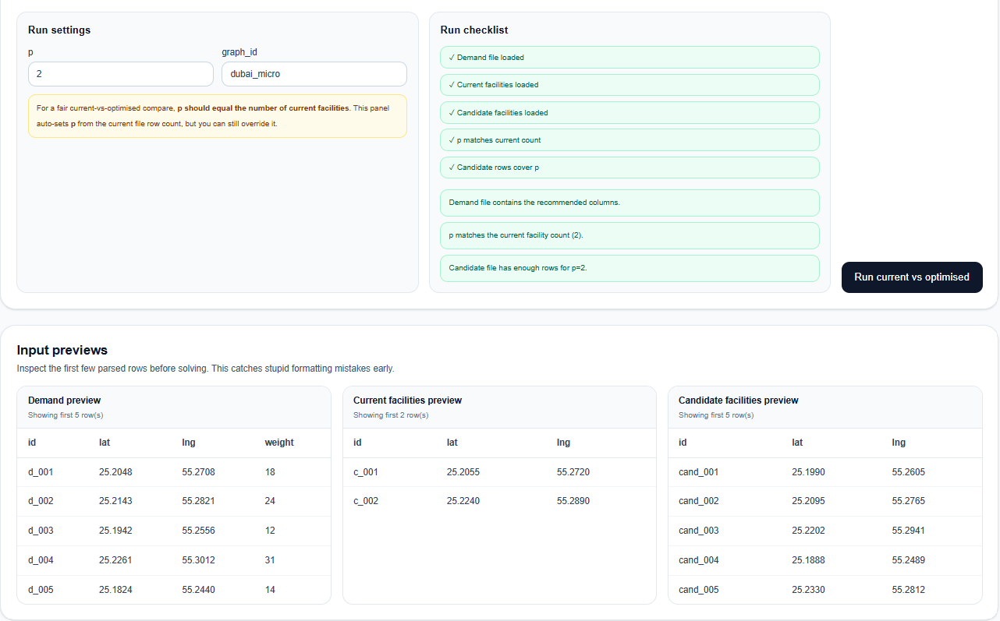
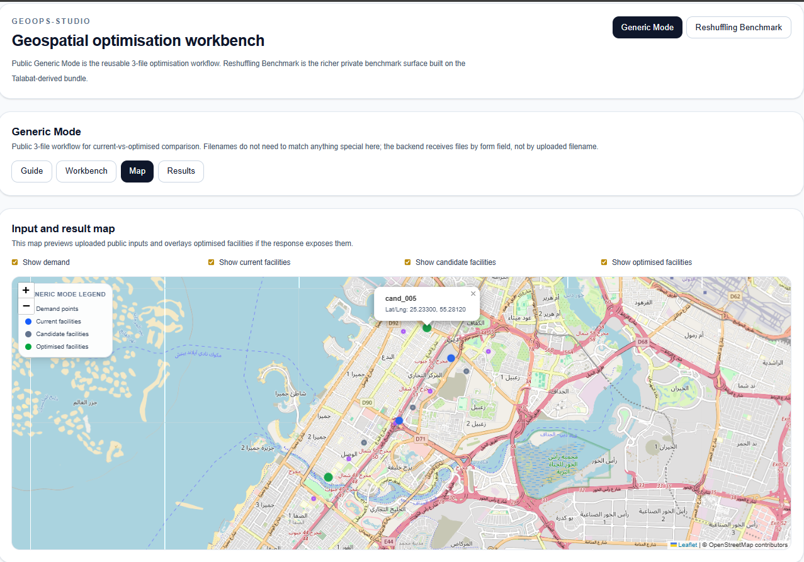
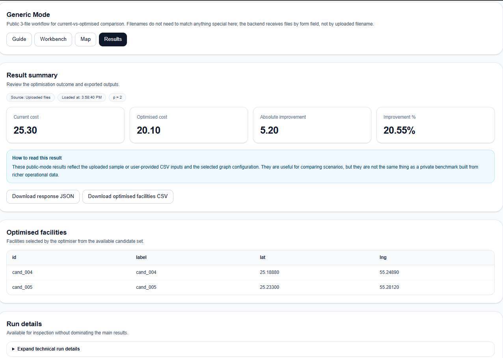

# GeoOps-Studio

GeoOps-Studio is a public geospatial optimisation app for comparing current facility layouts against p-median-style optimised alternatives using uploaded CSV inputs, backend optimisation, and interactive map outputs.

## What you can do in 2 minutes

1. Open Generic Mode
2. Run the built-in demo, or load the sample CSVs
3. Inspect the map, summary metrics, and selected optimised facilities
4. Export the result JSON and facility table

## Public workflow at a glance

- upload demand points
- upload current facilities
- upload candidate facilities
- run current-vs-optimised comparison
- inspect map and results
- export outputs

The app has two surfaces:

- **Generic Mode**: the public three-file optimisation workflow
- **Reshuffling Benchmark**: a richer private benchmark surface backed by local non-public bundle outputs

The project is designed to be:

- usable locally as a real app, not just a notebook artefact
- explainable in interviews and portfolio reviews
- honest about the difference between public demo data and private benchmark data

---

## What the app does

At a high level, GeoOps-Studio lets you:

- load demand points, current facilities, and candidate facilities
- compare a current layout against an optimised layout
- inspect results on an interactive map
- export result payloads and selected facility tables
- explore a private reshuffling benchmark with richer diagnostics and visualisations

---

## Modes

### Generic Mode

Generic Mode is the public-facing workflow.

It accepts three CSV files:

- `demand`
- `current facilities`
- `candidate facilities`

It then runs a current-vs-optimised comparison and shows:

- current cost
- optimised cost
- absolute improvement
- improvement percentage
- selected optimised facilities
- map previews and exported outputs

This mode is meant to be reusable and understandable by someone who has never seen the private benchmark.

### Reshuffling Benchmark

Reshuffling Benchmark is the private benchmark surface.

It loads a local bundle created from the reshuffling pipeline and exposes:

- benchmark summary tables
- fairness and sensitivity views
- cuisine and movement analysis
- vendor explorer
- bundle-driven figures
- map-based inspection of current vs optimised outcomes

This mode is not a generic public uploader. It is a controlled benchmark viewer for a specific private bundle.

---

## Important interpretation note

The **Reshuffling Benchmark** should be read as a **graph-supported benchmark of constrained reassignment under the project's chosen cost definition**.

It is **not** a literal replay of actual rider trajectories turn by turn.

That means:

- the benchmark is still meaningful as a comparative optimisation exercise
- the reported savings are benchmark savings under the modelled objective
- the benchmark should not be described as exact reconstructed rider-route kilometres saved in the real world

Similarly, map lines and location comparisons in the UI are there to help explain the benchmark, not to claim exact historical delivery paths.

---

## Public sample data

The repository includes public sample CSV files for Generic Mode:

- `frontend/public/samples/sample_demand.csv`
- `frontend/public/samples/sample_current_facilities.csv`
- `frontend/public/samples/sample_candidate_facilities.csv`

These are small illustrative starter files used for:

- the built-in demo route
- loading samples into the Generic Mode workbench
- testing the public workflow end to end

They are useful for demonstrating the product flow, but they are **not** meant to represent private operational coverage or production-quality benchmarking.

---

## Project structure

```text
GeoOps-Studio/
├─ backend/
│  └─ app/
│     ├─ api/
│     ├─ services/
│     ├─ schemas.py
│     └─ main.py
├─ engine/
│  ├─ network/
│  └─ optimisation/
├─ frontend/
│  ├─ public/
│  │  └─ samples/
│  └─ src/
│     ├─ api/
│     ├─ app/
│     ├─ components/
│     └─ types/
├─ private_bundles/ # expected locally for private benchmark mode; not public
└─ README.md
```

---

## Architecture overview



---

## Tech stack

### Frontend

- Next.js
- React
- TypeScript
- Tailwind CSS
- Leaflet / React Leaflet

### Backend

- FastAPI
- Pandas
- OR-Tools
- Python

### Engine

- road-network snapping and cost preparation
- p-median style optimisation workflow
- private bundle-driven reshuffling analysis

---

## Quick start

### 1. Clone the repository

```bash
git clone https://github.com/dvp2004/GeoOps-Studio.git GeoOps-Studio
```

### 2. Create and activate a virtual environment

On Windows:

```bash
python -m venv .venv
.venv\Scripts\activate
```

### 3. Install backend dependencies

```bash
pip install -r backend/requirements.txt
```

If you are managing dependencies another way, make sure the backend environment includes at least:

```
fastapi
uvicorn
pandas
ortools
pyarrow
```

### 4. Install frontend dependencies

```bash
cd frontend && npm install
```

### 5. Start the backend

From the repo root:

```bash
python -m uvicorn backend.app.main:app --reload
```

Backend default URL:

```
http://127.0.0.1:8000
```

API docs:

```
http://127.0.0.1:8000/docs
```

### 6. Start the frontend

From `frontend/`:

```bash
npm run dev
```

Frontend default URL:

```
http://localhost:3000
```

---

## Generic Mode workflow

### Option A: run the built-in demo

Use the **Run built-in demo** button in Generic Mode.

This uses the public sample CSV files stored in:

```
frontend/public/samples/sample_demand.csv
frontend/public/samples/sample_current_facilities.csv
frontend/public/samples/sample_candidate_facilities.csv
```

### Option B: upload your own CSVs

Use the Generic Mode workbench and upload:

- a demand CSV
- a current facilities CSV
- a candidate facilities CSV

#### Why current and candidate files use the same CSV schema

In Generic Mode, the **current facilities** file and the **candidate facilities** file intentionally use the same facility-point schema:

- `id`
- `lat`
- `lng`

This is deliberate.

At the CSV-validation level, both files represent the same kind of object: a set of facility locations on the graph. The difference between them is **not structural**, it is **semantic**:

- the **current facilities** file defines the facilities that are open in the baseline layout
- the **candidate facilities** file defines the pool of facilities the optimiser is allowed to choose from

Because both files are just facility-point sets, the app applies the same low-level validation checks to both:
- required identifier field
- coordinate presence
- coordinate parseability

This avoids duplicating identical validation rules for two files that share the same structure.

The distinction between the two files is enforced later in the optimisation flow, not in the raw CSV schema. In particular:

- the current file is used to compute the baseline layout
- the candidate file is used as the optimisation choice set
- for fair current-vs-optimised comparison, `p` should match the number of current facilities

So the design choice was:

- **same schema for validation**
- **different semantic roles in the solver**

Recommended columns are shown in the UI and sample row formats are provided.

Generic Mode also includes:

- sample loading
- row previews
- validation notes
- map previews
- result exports

---

## Reshuffling Benchmark workflow

The Reshuffling Benchmark expects a local private bundle to be present.

Current supported local bundle:

```
private_bundles/ (expected locally for private benchmark mode; not public)
```

The benchmark UI reads bundle outputs such as:

- headline tables
- fairness tables
- sensitivity summaries
- vendor analysis parquet files
- benchmark figures
- conclusion text

The backend exposes private reshuffling routes so the frontend can:

- discover available bundles
- inspect required files
- load vendor explorer data
- render benchmark summaries and maps

### Required private bundle files

The private reshuffling bundle currently expects benchmark outputs such as:

```
assignment_access_topk80_analysis.parquet
final_fairness_table_k80.csv
final_headline_table_k80.csv
final_k_sensitivity_table.csv
final_section_conclusion_k80.txt
final_top_cuisines_k80.csv
final_top_losers_k80.csv
final_top_winners_k80.csv
```

Some additional model files may also be present for richer local exploration.

The app exposes a backend route listing the currently expected files:

```
GET /api/private/reshuffling/required-files
```

---

## Key backend routes

### Generic Mode

```
GET  /api/demo/current-vs-optimised
POST /api/compare-current-vs-p-median
```

### Private reshuffling benchmark

```
GET /api/private/reshuffling/bundles
GET /api/private/reshuffling/required-files
```

Additional bundle-driven reshuffling routes used by the frontend benchmark panels.

---

## What is public and what is private

### Public

- Generic Mode workflow
- public sample CSVs
- public app structure
- optimisation workbench concept
- frontend and backend code that supports the public workflow

### Private

- internal reshuffling bundle contents
- non-public delivery-platform benchmark data
- private benchmark outputs not suitable for public release
- any internal datasets or derived files that rely on non-public operational data

The repo is structured so the public product remains explainable without exposing private source data.

---

## Current status

GeoOps-Studio is currently positioned as:

- a working public geospatial optimisation workbench
- plus a private reshuffling benchmark surface for local evaluation

The Generic Mode is the reusable public-facing path.

The Reshuffling Benchmark is the richer internal benchmark view.

---

## Known limits

- Generic Mode is designed for small-to-medium uploaded scenarios, not large private operational datasets.
- The private Reshuffling Benchmark depends on local non-public benchmark bundles that are not shipped in the public repository.
- Benchmark savings in the private mode are model-based comparative savings under the chosen objective, not literal replayed rider-route history.
- The public workflow and the private benchmark are related, but they are not identical in data richness or benchmark depth.

---

## Why this project exists

This project is meant to show more than just raw model code.

It demonstrates the full chain:

- data ingestion
- validation
- optimisation
- result interpretation
- mapping and UI presentation
- separation between public reproducible demos and private benchmark evaluation

That is the real point of GeoOps-Studio.

## Screenshots

### Landing / Generic Mode guide


### Generic Mode workbench


### Generic Mode validation and previews


### Generic Mode map


### Generic Mode results


## Private benchmark note

The repository does not include screenshots of the private Reshuffling Benchmark view. That mode is driven by non-public benchmark artefacts derived from internal operational data, so the public README only shows the reusable Generic Mode workflow.