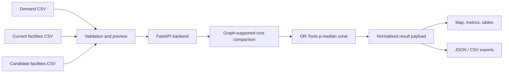

# GeoOps-Studio

GeoOps-Studio is a full-stack geospatial optimisation workbench for comparing existing facility layouts against p-median-style optimised alternatives using CSV inputs, backend optimisation, and interactive map outputs.

The public version is designed to run locally with included sample CSVs. A separate private benchmark mode supports richer local analysis from non-public benchmark bundles without exposing private operational data.

---

## What problem does it solve?

Facility-location decisions are often judged visually: “does this site look close enough to demand?” That can be misleading.

GeoOps-Studio helps users test whether facilities, hubs, or service points are spatially efficient by comparing:

- where facilities are currently located
- where an optimiser would place or select facilities from a candidate pool
- how much the modelled objective improves
- which locations are selected in the optimised scenario

The public workflow is intentionally simple: upload three CSV files, run the comparison, and inspect the result through maps, metrics, and exports.

---

## Who is it for?

GeoOps-Studio is useful for:

- analysts testing facility-location scenarios
- operations teams comparing current and candidate layouts
- students or researchers exploring p-median-style optimisation
- portfolio reviewers who want to see a complete geospatial decision-support workflow rather than a notebook-only project

---

## What you can do in 2 minutes

1. Open **Generic Mode**
2. Run the built-in demo, or load the included sample CSVs
3. Inspect the input map, summary metrics, and selected optimised facilities
4. Export the result JSON and selected facility table

The repository includes public sample files, so the app can be tested without private data.

---

## Public workflow at a glance



---

## Screenshots

### Landing / Generic Mode guide


### Generic Mode workbench


### Generic Mode validation and previews


### Generic Mode map


### Generic Mode results


---

## Example use case

A user has:

- demand points representing customer demand, population, orders, or service requests
- current facilities representing the existing service network
- candidate facilities representing possible alternative sites

GeoOps-Studio compares the current layout against an optimised p-median-style selection from the candidate pool.

The output shows:

- current weighted cost
- optimised weighted cost
- absolute improvement
- percentage improvement
- selected optimised facilities
- map-based visualisation of inputs and outputs
- downloadable JSON and CSV results

---

## Public Generic Mode

Generic Mode is the public-facing workflow.

It accepts three CSV files:

- a demand CSV
- a current facilities CSV
- a candidate facilities CSV

It then runs a current-vs-optimised comparison and returns:

- summary metrics
- selected optimised facilities
- map-ready output layers
- downloadable JSON and CSV results

Generic Mode is the main reusable public workflow in this repository.

---

## Public input files

### 1. Demand CSV

The demand CSV represents demand points such as customers, orders, population, service requests, or other weighted demand locations.

Recommended columns:

```text
id,lat,lng,weight
```

Example:

```csv
id,lat,lng,weight
d_001,25.2048,55.2708,18
```

### 2. Current facilities CSV

The current facilities CSV represents the existing baseline facility layout.

Recommended columns:

```text
id,lat,lng
```

Example:

```csv
id,lat,lng
c_001,25.2055,55.2720
```

### 3. Candidate facilities CSV

The candidate facilities CSV represents the pool of possible facilities the optimiser is allowed to choose from.

Recommended columns:

```text
id,lat,lng
```

Example:

```csv
id,lat,lng
cand_001,25.1990,55.2605
```

Generic Mode includes:

- sample CSV loading
- CSV upload and validation
- row and column previews
- map visualisation
- current-vs-optimised p-median comparison
- selected-facility table
- JSON and CSV export

---

## Why current and candidate files use the same CSV schema

In Generic Mode, the **current facilities** file and the **candidate facilities** file intentionally use the same facility-point schema:

- `id`
- `lat`
- `lng`

This is deliberate.

At the CSV-validation level, both files represent the same kind of object: a set of facility locations on the graph. The difference between them is **semantic**, not structural:

- the **current facilities** file defines the facilities currently open in the baseline layout
- the **candidate facilities** file defines the pool of facilities the optimiser is allowed to choose from

Because both files are facility-point sets, the app applies the same low-level validation checks to both:

- required identifier field
- coordinate presence
- coordinate parseability

The distinction is enforced later in the optimisation flow:

- the current file defines the baseline facility set
- the candidate file defines the optimisation pool
- for a fair current-vs-optimised comparison, `p` should match the number of current facilities

So the design choice was:

- **same schema for validation**
- **different semantic roles in the solver**

---

## Methodology

The public workflow follows this sequence.

### 1. Input validation

Uploaded CSVs are checked for:

- required columns
- parseable coordinates
- duplicate IDs
- valid demand weights

This catches common input issues before the optimisation step.

### 2. Graph-supported comparison

Demand and facility points are mapped into the app’s network-cost workflow. The current layout and candidate layout are evaluated through the same comparison interface.

### 3. Baseline assignment

Demand points are assigned to the current facility set to compute the baseline weighted cost.

### 4. Optimised p-median comparison

OR-Tools is used to select `p` candidate facilities and assign demand points to the selected facilities.

### 5. Normalised result payload

The backend returns a consistent response containing:

- summary metrics
- selected facilities
- assignments
- map-ready outputs
- exportable result data

### 6. Frontend interpretation

The frontend displays:

- input previews
- map layers
- current and optimised metrics
- selected optimised facilities
- downloadable JSON and CSV outputs

---

## Public sample data

The repository includes public sample CSV files:

```text
frontend/public/samples/sample_demand.csv
frontend/public/samples/sample_current_facilities.csv
frontend/public/samples/sample_candidate_facilities.csv
```

These are small illustrative starter files used for:

- the built-in demo route
- loading samples into the Generic Mode workbench
- testing the public workflow end to end

They are not intended to represent private operational coverage or production-scale benchmarking.

---

## Private benchmark mode

The repository also includes code for a private **Reshuffling Benchmark** mode.

This mode is not a public uploader. It is a local benchmark viewer for non-public benchmark bundles.

It supports views such as:

- headline benchmark tables
- fairness and sensitivity analysis
- cuisine-level movement analysis
- top winners and losers
- vendor-level explorer
- benchmark figure panels

The private benchmark is useful for richer internal analysis, but the public repository does not include the private source data, private bundle contents, or private benchmark screenshots.

---

## Important interpretation note

The private Reshuffling Benchmark should be read as a graph-supported benchmark of constrained reassignment under the project’s chosen cost definition.

It is **not** a literal replay of actual rider trajectories turn by turn.

That means:

- benchmark savings are model-based comparative savings
- map lines are explanatory visual aids, not reconstructed historical rider paths
- private benchmark outputs should not be described as exact real-world rider-route kilometres saved

---

## Private bundle structure

The private Reshuffling Benchmark expects a local private bundle folder.

Expected local location:

```text
private_bundles/
```

This directory is intentionally excluded from the public repository.

The benchmark UI reads bundle outputs such as:

- headline tables
- fairness tables
- sensitivity summaries
- vendor analysis parquet files
- benchmark figures
- conclusion text

Example required benchmark output files include:

```text
assignment_access_topk80_analysis.parquet
final_fairness_table_k80.csv
final_headline_table_k80.csv
final_k_sensitivity_table.csv
final_section_conclusion_k80.txt
final_top_cuisines_k80.csv
final_top_losers_k80.csv
final_top_winners_k80.csv
```

The backend exposes a route listing the currently expected private benchmark files:

```text
GET /api/private/reshuffling/required-files
```

---

## Tech stack

### Frontend

- Next.js
- React
- TypeScript
- Tailwind CSS
- Leaflet / React Leaflet

### Backend

- FastAPI
- Pandas
- NumPy
- OR-Tools
- Python

### Engine

- graph-supported cost preparation
- p-median-style optimisation
- assignment and comparison logic
- private bundle-driven benchmark analysis

---

## Project structure

```text
GeoOps-Studio/
├─ backend/
│  └─ app/
│     ├─ api/
│     ├─ services/
│     ├─ schemas.py
│     └─ main.py
├─ engine/
│  ├─ network/
│  └─ optimisation/
├─ frontend/
│  ├─ public/
│  │  └─ samples/
│  └─ src/
│     ├─ api/
│     ├─ app/
│     ├─ components/
│     └─ types/
├─ private_bundles/          # expected locally for private benchmark mode; not public
└─ README.md
```

---

## Key backend routes

### Generic Mode

```text
GET  /api/demo/current-vs-optimised
POST /api/compare-current-vs-p-median
```

### Private benchmark mode

```text
GET /api/private/reshuffling/bundles
GET /api/private/reshuffling/required-files
```

Additional bundle-driven reshuffling routes are used by the frontend benchmark panels when private local benchmark files are available.

---

## Quick start

### 1. Clone the repository

```bash
git clone https://github.com/dvp2004/GeoOps-Studio.git GeoOps-Studio
cd GeoOps-Studio
```

### 2. Create and activate a virtual environment

On Windows:

```bash
python -m venv .venv
.venv\Scripts\activate
```

### 3. Install backend dependencies

```bash
pip install -r backend/requirements.txt
```

### 4. Install frontend dependencies

```bash
cd frontend
npm install
```

### 5. Start the backend

From the repository root:

```bash
python -m uvicorn backend.app.main:app --reload
```

Backend default URL:

```text
http://127.0.0.1:8000
```

API docs:

```text
http://127.0.0.1:8000/docs
```

### 6. Start the frontend

From `frontend/`:

```bash
npm run dev
```

Frontend default URL:

```text
http://localhost:3000
```

---

## What is public and what is private?

### Public

- Generic Mode workflow
- public sample CSVs
- public app structure
- optimisation workbench concept
- frontend and backend code supporting the public workflow

### Private

- internal benchmark bundle contents
- non-public delivery-platform benchmark data
- private benchmark outputs not suitable for public release
- private source datasets or derived artefacts based on non-public operational data

The repository is structured so the public product remains explainable without exposing private source data.

---

## Known limits

- Generic Mode is designed for small-to-medium uploaded scenarios, not large private operational datasets.
- The private Reshuffling Benchmark depends on local non-public benchmark bundles that are not shipped in the public repository.
- Benchmark savings in private mode are model-based comparative savings under the chosen objective, not literal replayed rider-route history.
- The public workflow and private benchmark are related, but they are not identical in data richness or benchmark depth.
- The project is currently best treated as a local portfolio/demo workflow rather than a permanently hosted public service.

---

## Future improvements

- Add a stable hosted demo once backend hosting is reliable.
- Add a clearer public case-study page explaining an end-to-end sample scenario.
- Add optional support for larger public scenarios with clearer runtime guidance.
- Add automated tests for CSV validation and solver edge cases.
- Add CI checks for frontend build and backend route health.
- Add richer documentation for extending the graph/cost backend.

---

## Why this project exists

This project is meant to show more than raw model code.

It demonstrates the full chain:

- data ingestion
- validation
- optimisation
- result interpretation
- mapping and UI presentation
- separation between public reproducible demos and private benchmark evaluation

The aim is to turn a spatial optimisation idea into a usable decision-support workflow with a clear public demo path and a safe private benchmark extension.

---

## Private benchmark note

The public README intentionally does not include screenshots of the private Reshuffling Benchmark view. That mode is driven by non-public benchmark artefacts, so the public documentation only shows the reusable Generic Mode workflow.